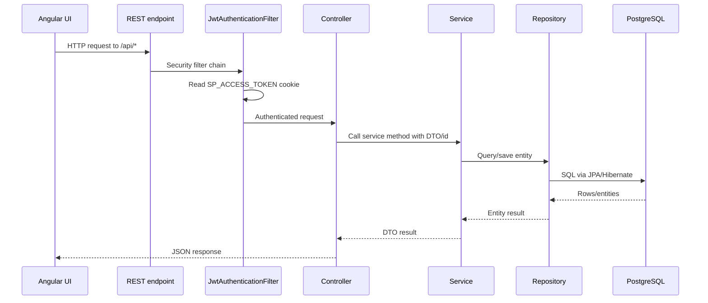

# Application Architecture

## High-level Architecture

ServicePilot follows the intended flow:

`Angular frontend -> REST API -> Spring Boot controllers -> Services -> Repositories -> PostgreSQL database`

The backend is the main implemented layer. The frontend now has an Angular auth shell with login/register pages and HTTP auth plumbing, while most domain workflows are still planned.

```mermaid
flowchart LR
    Browser["Browser"]
    Angular["Angular frontend\nfrontend/src"]
    REST["REST API\n/api/*"]
    Controllers["Spring Boot controllers\ncontrollers package"]
    Services["Service interfaces + implementations\nservices package"]
    Repos["Spring Data JPA repositories\nrepos package"]
    Entities["JPA entities\nentities package"]
    DB["PostgreSQL\nservicepilot database"]
    Security["Spring Security\nJWT + HttpOnly cookies"]

    Browser --> Angular
    Angular --> REST
    REST --> Security
    Security --> Controllers
    Controllers --> Services
    Services --> Repos
    Repos --> Entities
    Entities --> DB
```

## Backend Architecture

Backend root package: `hr.domagoj.servicepilot`.

| Layer | Location | Current role |
| --- | --- | --- |
| Application entry | `BackendApplication.java` | Starts Spring Boot |
| Controllers | `controllers` | Expose REST endpoints under `/api/...` |
| DTOs | `DTOs` | Public request/response records |
| Services | `services/interfaces`, `services/implementations` | Business operations and DTO mapping |
| Repositories | `repos` | Spring Data JPA persistence |
| Entities | `entities` | JPA database model |
| Enums | `enums` | Domain state values |
| Security | `config`, `security` | Auth filter chain, JWT creation/validation, cookies |
| Exceptions | `exceptions` | API error model and handlers |
| Seeders | `seeders` | Startup demo data through `ApplicationRunner` |

The controllers depend directly on implementation classes such as `CustomerServiceImpl`, not the service interfaces. This is implemented and compiles as code structure, but using interfaces in controllers is a planned cleanup if the project wants stricter layering.

## Frontend Architecture

Frontend root: `frontend`.

Current files:

- `frontend/package.json`: Angular 21, TypeScript, Tailwind/PostCSS dependencies.
- `frontend/src/main.ts`: bootstraps `App`.
- `frontend/src/app/app.config.ts`: provides router, HTTP client, XSRF configuration, and auth interceptor.
- `frontend/src/app/app.routes.ts`: routes login, register, home, and dashboard.
- `frontend/src/app/app.ts`: root standalone component.
- `frontend/src/app/app.html`: switches between auth pages and the app shell.
- `frontend/src/styles.css`: default global style placeholder.
- `frontend/src/app/pages`: login, register, home, and dashboard pages.
- `frontend/src/app/core/layout`: sidebar, topbar, and footer shell components.
- `frontend/src/app/core/services/auth.ts`: auth API service.
- `frontend/src/app/core/http`: auth HTTP interceptor and refresh-session helper.

Current frontend status is partial shell. Auth pages, reactive forms, an auth API service, layout components, current-user topbar state, and an auth interceptor exist. Domain API services, route guards, role-aware navigation, and most feature pages are still planned.

## Database Architecture

Implemented database approach:

- PostgreSQL is configured in `docker-compose.yml` as service `db`.
- Backend uses `spring.datasource.url=jdbc:postgresql://localhost:5432/servicepilot`.
- JPA entities map to tables through annotations.
- `spring.jpa.hibernate.ddl-auto=update` is enabled.
- Flyway dependencies exist in `backend/pom.xml`, and `spring.flyway.enabled=true` in `application.properties`.
- Initial migration files exist under `backend/src/main/resources/db/migration`.
- `backend/src/main/resources/db/ServicePilotDiagram.png` exists, but it is a diagram asset, not an executable migration.

Important assumption: the current schema can still be generated/updated by Hibernate in development because `spring.jpa.hibernate.ddl-auto=update` remains enabled. The project should decide whether to keep that temporarily or move fully to Flyway-managed schema changes.

## Security/Auth Architecture

Implemented security files:

- `SecurityConfig`: Spring Security filter chain, CORS, CSRF token repository, stateless sessions, authenticated default policy.
- `PasswordConfig`: BCrypt `PasswordEncoder`.
- `JwtService`: custom HS256 JWT implementation using `SecurityProperties`.
- `JwtAuthenticationFilter`: reads access token from cookie and authenticates requests.
- `CookieService`: writes HttpOnly access and refresh token cookies.
- `RefreshTokenService`: creates, hashes, rotates, and revokes refresh tokens stored in the database.
- `CustomUserDetailsService` and `CustomUserPrincipal`: load users and expose `ROLE_...` authorities.

Current authorization behavior:

- Public endpoints: `/api/auth/register`, `/api/auth/login`, `/api/auth/refresh`, `/api/auth/logout`, `/api/auth/csrf`.
- All other requests require authentication.
- `@EnableMethodSecurity` is present, but no controller/service `@PreAuthorize` rules were found.
- `/api/auth/logout` is public so it can clear/revoke refresh cookies even when the access cookie is expired. CSRF protection still applies to the POST request.
- `/api/auth/csrf` is implemented in `AuthController`.

## Layer Communication

## Configuration Files

| File | Purpose | Status |
| --- | --- | --- |
| `backend/pom.xml` | Spring Boot 3.3.5, Java 21, JPA, Security, Web, Validation, PostgreSQL, Flyway, Quartz | Implemented |
| `backend/src/main/resources/application.properties` | Server, database, JPA, Flyway, JWT/cookie/CORS settings | Implemented |
| `docker-compose.yml` | Local PostgreSQL 16 service | Implemented |
| `frontend/package.json` | Angular 21 project scripts and dependencies | Implemented |
| `frontend/angular.json` | Angular build/serve/test configuration | Implemented |

