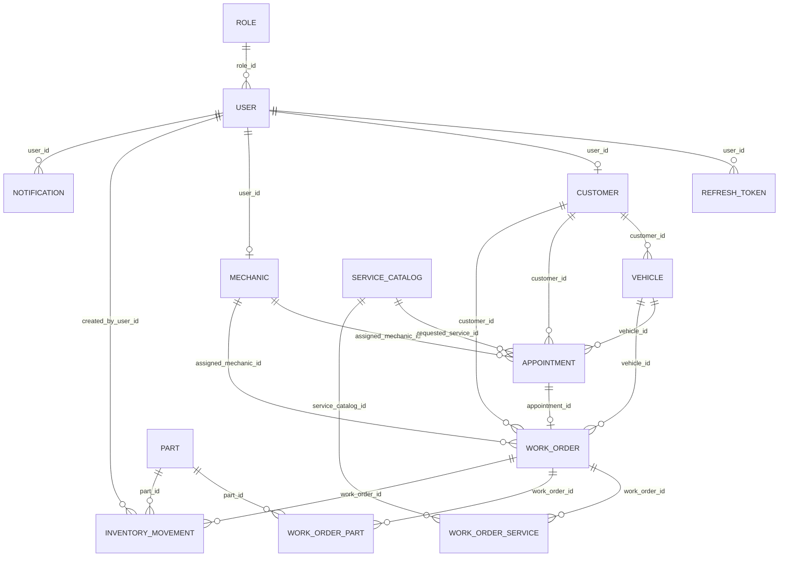

# Entity Relationships

## Relationship Summary

## Detailed Relationships

| Relationship | Type | Owning entity | Why it exists | Business example | Cascade recommendation | Index recommendation | Risks |
| --- | --- | --- | --- | --- | --- | --- | --- |
| `User.role -> Role` | ManyToOne | `User` | A user has one business role | Sara is a `SERVICE_ADVISOR` | No cascade from user to role | Index `users.role_id`; unique `roles.name` exists by column | No multi-role support |
| `RefreshToken.user -> User` | ManyToOne | `RefreshToken` | Track sessions by user | User logs in from browser | No cascade from token to user; consider deleting tokens when user deleted | Implemented indexes on `token_hash` and `user_id` | Token cleanup job not implemented |
| `Customer.user -> User` | OneToOne | `Customer` | Connect customer profile to login identity | Customer Ivan logs into portal | No cascade by default; create in one transaction | Unique index on `customers.user_id`; index `customers.email` | API create currently omits required user |
| `Mechanic.user -> User` | OneToOne | `Mechanic` | Connect employee mechanic profile to login identity | Marko has mechanic profile and login | No cascade by default | Unique index on `mechanics.user_id` | Public registration should not create mechanics |
| `Vehicle.customer -> Customer` | ManyToOne | `Vehicle` | Vehicles belong to customers | Ana owns a Golf and Yaris | No cascade from vehicle to customer | Index `vehicles.customer_id`; consider unique `vin` or `registration_plate` | `registrationPlate` repository lookup exists but column is not unique |
| `Appointment.customer -> Customer` | ManyToOne | `Appointment` | Appointment is requested by a customer | Ivan books diagnostics | No cascade | Index `appointments.customer_id`, `scheduled_start` | Service does not validate customer/vehicle consistency yet |
| `Appointment.vehicle -> Vehicle` | ManyToOne | `Appointment` | Appointment is for a specific vehicle | Golf appointment for brake noise | No cascade | Index `appointments.vehicle_id` | Vehicle could belong to another customer if validation missing |
| `Appointment.assignedMechanic -> Mechanic` | ManyToOne optional | `Appointment` | Optional pre-assignment | Diagnostics assigned to Marko | No cascade | Index `appointments.assigned_mechanic_id` | Mechanic availability is not enforced |
| `Appointment.requestedService -> ServiceCatalog` | ManyToOne optional | `Appointment` | Link requested type of service | Customer requests small service | No cascade | Index `appointments.requested_service_id` | Historical price/name not snapshotted on appointment |
| `WorkOrder.appointment -> Appointment` | OneToOne optional | `WorkOrder` | Work order may originate from appointment | Confirmed visit becomes work order | No cascade, or restricted cascade only during conversion | Unique index on `work_orders.appointment_id` | No conversion service yet |
| `WorkOrder.customer -> Customer` | ManyToOne | `WorkOrder` | Work is done for a customer | Petar's BMW repair | No cascade | Index `work_orders.customer_id` | Customer/vehicle mismatch possible without validation |
| `WorkOrder.vehicle -> Vehicle` | ManyToOne | `WorkOrder` | Work is done on a vehicle | BMW 320d work order | No cascade | Index `work_orders.vehicle_id` | Vehicle ownership should be checked |
| `WorkOrder.assignedMechanic -> Mechanic` | ManyToOne optional | `WorkOrder` | Assign work to technician | Marko gets brake replacement | No cascade | Index `work_orders.assigned_mechanic_id` | No workload or status transition rules |
| `WorkOrderService.workOrder -> WorkOrder` | ManyToOne | `WorkOrderService` | Services/tasks belong to work order | Add brake replacement task | Cascade from work order to line items could be valid; avoid line item deleting parent | Index `work_order_services.work_order_id` | No API to add/remove services |
| `WorkOrderService.serviceCatalog -> ServiceCatalog` | ManyToOne | `WorkOrderService` | Source catalog item | Task snapshots "Small service" | No cascade | Index `work_order_services.service_catalog_id` | Snapshot fields must be populated by future service code |
| `WorkOrderPart.workOrder -> WorkOrder` | ManyToOne | `WorkOrderPart` | Parts usage belongs to work order | Two brake pads used | Cascade from work order to part usages may be valid | Index `work_order_parts.work_order_id` | No inventory stock deduction workflow |
| `WorkOrderPart.part -> Part` | ManyToOne | `WorkOrderPart` | Link used inventory item | Oil filter used | No cascade | Index `work_order_parts.part_id` | Part deletion should be restricted if used historically |
| `InventoryMovement.part -> Part` | ManyToOne | `InventoryMovement` | Movement changes a part's stock | Stock IN for oil | No cascade | Index `inventory_movements.part_id`, `created_at` | Movement API not implemented |
| `InventoryMovement.workOrder -> WorkOrder` | ManyToOne optional | `InventoryMovement` | Movement can come from repair usage | OUT caused by work order | No cascade | Index `inventory_movements.work_order_id` | Could desync from `WorkOrderPart` if not transactional |
| `InventoryMovement.createdByUser -> User` | ManyToOne optional | `InventoryMovement` | Audit who made stock change | Advisor adjusts stock | No cascade | Index `inventory_movements.created_by_user_id` | Null user allowed, audit may be incomplete |
| `Notification.user -> User` | ManyToOne optional | `Notification` | Target a user | Mechanic gets work-order alert | No cascade, optionally delete notifications on user deletion | Index `notifications.user_id`, `created_at`, `is_read` | Endpoint accepts arbitrary `userId`; owner checks missing |

## Data Integrity Notes

- The current model relies mostly on JPA relationships and database constraints generated by Hibernate.
- Explicit indexes are implemented only on `RefreshToken`.
- Foreign-key indexes are recommended for all relationship columns because the API will often list by customer, vehicle, mechanic, status, and date.
- Cascades should be conservative. Core reference data such as `Role`, `User`, `Customer`, `Vehicle`, `Part`, and `ServiceCatalog` should not be accidentally deleted through child operations.
- Work order line items are good candidates for cascading from `WorkOrder` to child line items if delete/archive semantics are well defined.

