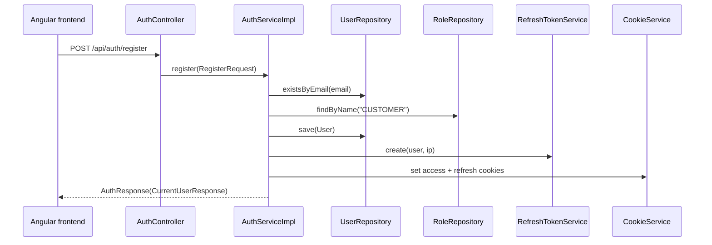
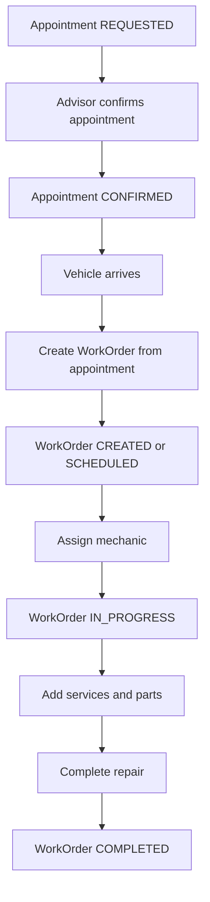
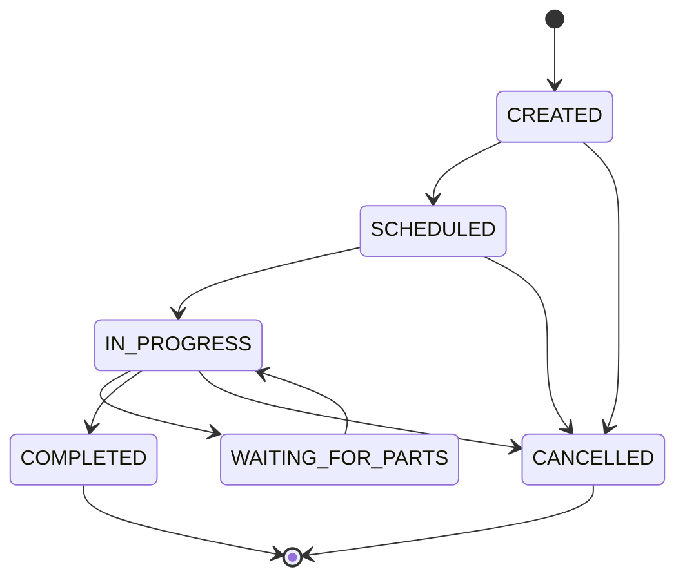

# How The Application Works

## Current User Perspective

The backend exposes JSON REST endpoints. Except for registration, login, refresh, and the whitelisted but missing CSRF endpoint, requests must be authenticated through cookies set by the auth endpoints.

The frontend currently does not implement user workflows. It is an Angular scaffold with empty routes, so all end-user flows below are backend-only or planned.

## Registration and Login

Status: implemented backend auth, planned frontend UI.

Implemented:

- `POST /api/auth/register` accepts `RegisterRequest`.
- `AuthServiceImpl.register` checks duplicate email, loads the `CUSTOMER` role, creates a `User`, and issues auth cookies.
- `POST /api/auth/login` verifies email/password and active flag.
- `POST /api/auth/refresh` rotates refresh tokens.
- `POST /api/auth/logout` revokes refresh token and clears cookies.
- `GET /api/auth/me` returns `CurrentUserResponse`.

Important TODO:

- Registration creates a `User` with role `CUSTOMER`, but does not create a linked `Customer` entity.
- `/api/auth/csrf` is whitelisted in security but not implemented in `AuthController`.

## Admin Managing Users/Employees

Status: planned.

Implemented pieces:

- `RoleSeeder` creates `ADMIN`, `SERVICE_ADVISOR`, `MECHANIC`, and `CUSTOMER`.
- `UserSeeder` creates demo admin/advisor/mechanic users.
- `MechanicSeeder` creates mechanic profiles for seeded mechanic users.

Missing pieces:

- No `UserController`.
- No admin-only create employee endpoint.
- No frontend admin/users page.
- No role-based endpoint rules.

Rule: public registration should create only a `CUSTOMER` user. Employees should be created by an `ADMIN`.

## Creating a Customer

Status: partial.

Implemented:

- `Customer` entity and `CustomerDTO`.
- `CustomerController` exposes list, get, create, update, delete.
- `CustomerServiceImpl` maps between entity and DTO.

Risk/TODO:

- `Customer.user` is non-null and unique, but `CustomerDTO` has no `userId`, and `createCustomer` does not set `user`.
- This means customer creation through the current API may fail at persistence time or produce an inconsistent model if database constraints differ.

## Adding a Vehicle

Status: implemented backend CRUD.

Flow:

1. Client sends `VehicleDTO` with `customerId`.
2. `VehicleController.createVehicle` calls `VehicleServiceImpl.createVehicle`.
3. Service loads the customer with `CustomerRepository.findById`.
4. Service saves a `Vehicle` linked to that customer.

Planned:

- Enforce that a customer can only manage their own vehicles unless employee role.
- Add frontend vehicle form/list.

## Creating an Appointment

Status: partial.

Implemented:

- `Appointment` entity, `AppointmentDTO`, repository, service interface, and controller.
- `GET /api/appointments`, `GET /api/appointments/{id}`, and `DELETE /api/appointments/{id}` call working repository-backed methods.

Missing:

- `AppointmentServiceImpl.createAppointment` returns `null`.
- `AppointmentServiceImpl.updateAppointment` returns `null`.
- Date validation, customer/vehicle consistency validation, and mechanic availability checks are missing.

## Appointment To Work Order

Status: planned as a workflow; possible manually through `WorkOrderDTO.appointmentId`.

Current implementation allows `WorkOrderServiceImpl.createWorkOrder` to accept an optional `appointmentId` and set `WorkOrder.appointment` if found. It does not change appointment status, enforce one-time conversion beyond the unique database relationship, or copy appointment fields automatically.

## Assigning Work To A Mechanic

Status: partial.

Implemented:

- `WorkOrder.assignedMechanic` optional relationship.
- `WorkOrderDTO.assignedMechanicId`.
- `WorkOrderServiceImpl.createWorkOrder` and `updateWorkOrder` load mechanic if id exists.
- `Appointment.assignedMechanic` exists in the entity/DTO.

Missing:

- No dedicated assignment endpoint.
- No mechanic workload query.
- No frontend mechanic work queue.
- No authorization that only service advisors/admins can assign work.

## Updating Work Order Status

Status: partial.

Implemented:

- `WorkOrder.status` with `WorkOrderStatus`.
- `WorkOrderServiceImpl.updateWorkOrder` sets status from `WorkOrderDTO`.

Missing:

- No dedicated transition endpoint.
- No validation of allowed transitions.
- No automatic `openedAt` or `completedAt` timestamp behavior.
- No side effects such as notification or inventory movement.

## Adding Parts Or Service Tasks

Status: planned API, implemented data model.

Implemented:

- `WorkOrderService` entity for service tasks.
- `WorkOrderPart` entity for used parts.
- Repositories for both.
- `Part` CRUD under `/api/inventory/parts`.

Missing:

- No endpoints to add services/tasks to a work order.
- No endpoints to add used parts.
- No automatic stock adjustment.
- No inventory movement creation when parts are used.

## Completing A Work Order

Status: planned workflow, partial data support.

Implemented:

- `WorkOrder.completedAt` field.
- `WorkOrderStatus.COMPLETED`.
- Generic update endpoint can set these fields.

Missing:

- Completion workflow, validation, final document/invoice, notifications, and inventory reconciliation.

## Dashboard

Status: planned.

No dashboard controller, service, DTO, frontend route, or dashboard aggregation query was found.

